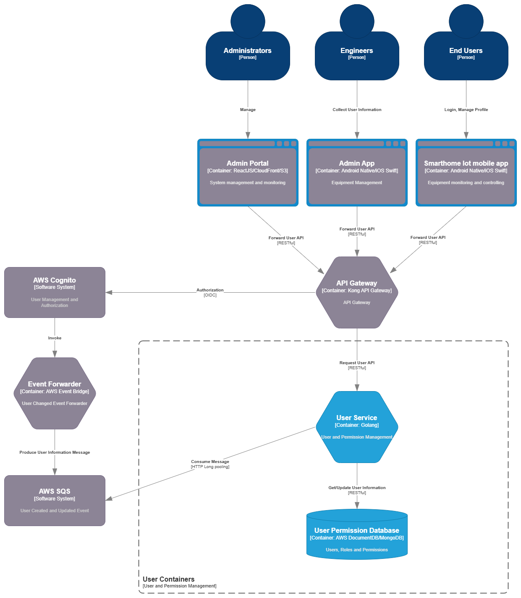

#### 5.2.3 User Service 

The **User Service** is responsible for managing user identity metadata, access roles, and authorization policies within the system. It enables **role-based access control (RBAC)** and **ownership-based policy enforcement** across core user types: Administrators, Engineers, and End Users.

User authentication and identity federation are handled by **AWS Cognito**, which serves as the system’s **identity provider (IdP)**. Cognito manages user credentials and authentication workflows, and integrates with **API Gateway via the OIDC protocol** to provide secure access control for all API interactions.

While Cognito manages authentication, the **User Service** is responsible for:

- Storing and managing **user metadata** (e.g., name, email, phone, associated building)
- Maintaining **roles, permissions, and user groups**
- Defining and enforcing **ownership and policy-based access rules**

To keep user metadata in sync, the system uses **AWS EventBridge** to capture **user creation and update events** from Cognito. These events are forwarded to an **SQS queue**, from which the User Service consumes and processes them to update or provision user records accordingly.

The User Service exposes internal **RESTful APIs** for user-related queries and management operations, used by services such as Device Service and Notification Service. It is containerized and deployed on **Amazon EKS**, with **MongoDB (via AWS DocumentDB)** as its backing datastore.