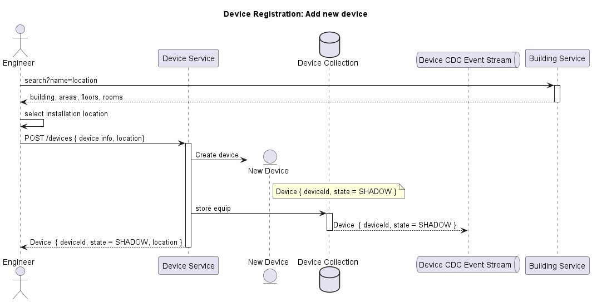
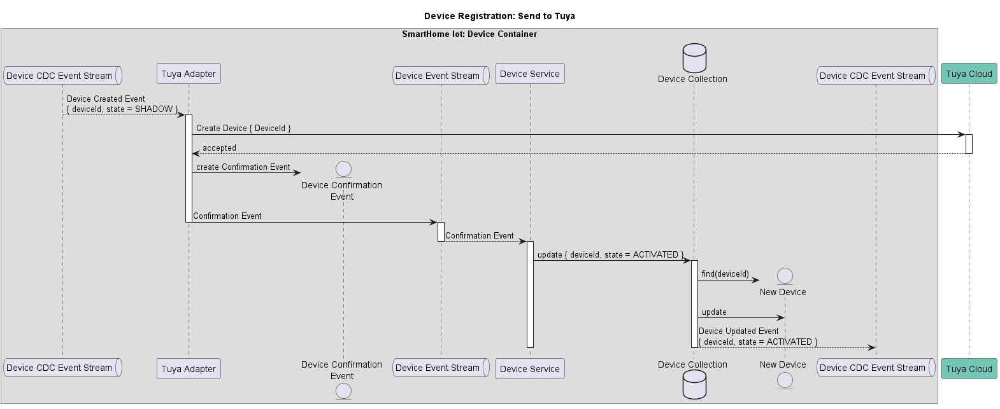
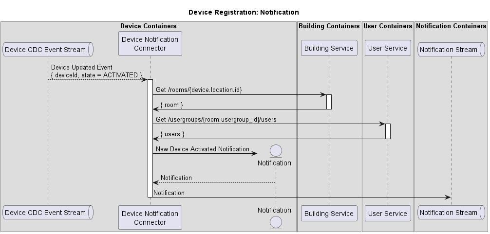

### 6.2 Device Registration

In the **Smarthome IoT** system, IoT devices are not managed or controlled directly. Instead, the system integrates with **Tuya Cloud**, which handles the actual device lifecycle and operations. As a result, when an Engineer registers a device, it enters the system as a **SHADOW** representation and only becomes **ACTIVATED** upon successful acceptance by Tuya Cloud. If Tuya Cloud rejects the device submission, the status changes to **REJECTED**.

**Step 1: Register Device**
- The Engineer selects the appropriate **area/room** of **Building** using the **Building Service API**.

- The Engineer submits a **Device Registration request** to the **Device Service**.

- The device is saved in the system in a **SHADOW state**, representing a pending registration.

- A CDC event is published to the **Device CDC Kafka Stream**.

**Step 2: Submit to Tuya Cloud**
- The **Tuya Adapter** listens for **new device CDC events** and submits the device information to **Tuya Cloud**.

- If **Tuya Cloud accepts** the device, the Tuya Adapter emits a **Device Confirmation Event** to the **Device Event Stream**.

- The **Device Service** consumes this confirmation event, updates the device’s state to **ACTIVATED**, and emits an updated **CDC event** to the **Device CDC Kafka Stream**.

**Step 3: Notify Associated Users**
- Once the device is activated, the **Device Notification Collector** gathers **location metadata** (e.g., Area/Room) from the **Building Service**.
- It then retrieves the list of **responsible users** from the **User Service**, based on the user group assigned to the device’s area, which was configured during the building construction process described in [Section 6.1](#61-building-construction).
- A notification is composed and sent to the Notification Stream.

The **Notification Service** will then take over the process, delivering notifications to end users and administrators via **Email**, **Push Notification**, or **SMS**, depending on user preferences and configured delivery methods.
