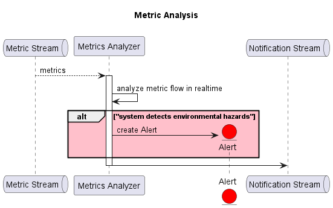

### 6.3 Device Event Processing and Metric Distribution

The **Tuya Adapter** plays a central role in continuously **subscribing to device events** from **Tuya Cloud** using a long-polling mechanism. Upon receiving each event, the adapter performs **initial preprocessing**, converting the raw Tuya payload into a standardized **SmartHome Iot** message format. These normalized events are then published to the **Device Event Stream** (Kafka topic).

The **Device Event ETL** service subscribes to the **Device Event Stream** and acts as the **primary processor** of incoming device events. It performs **real-time transformation**, **classification**, and **enrichment**, producing a variety of structured **metrics** (e.g., temperature, motion, power consumption). These metrics are then published to the **Metric Stream** for downstream consumers.

Several services in the **Smarthome Iot** platform consume the **Metric Stream** to support specialized business functions. Key services include:

- **Kafka–InfluxDB Connector** 
The **Kafka InfluxDB Connector** consumes metrics from the Metric Stream and writes them to the **InfluxDB Timeseries Database**. This enables system-wide telemetry analysis and historical monitoring. The **Device Manager** can present these metrics to Administrators via dashboards for visibility into system performance and trends.

- **Metrics Analyzer** 
The **Metrics Analyzer** service uses real-time metrics to detect **environmental hazards** and **identify potential threats**, such as **fire, smoke, gas leaks, or intrusions**. Alerts are triggered proactively based on defined thresholds or pattern recognition algorithms.

- **Equipment Behavior Optimizer**
The **Equipment Behavior Optimizer** processes metrics related to ***environmental conditions** — such as temperature and humidity—to determine if device behavior (e.g., air conditioning, lighting) should be adjusted. It sends optimization commands to improve **comfort**, **energy efficiency**, and **overall quality of life** in affected areas.

This runtime scenario illustrates how the system applies **stream processing**, **event normalization**, and **modular analytics pipelines** to derive real-time insights and automate actions within smart environments.
