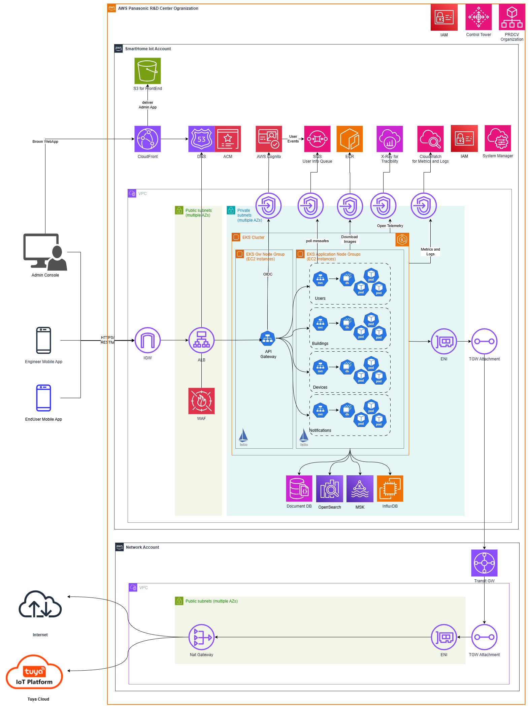
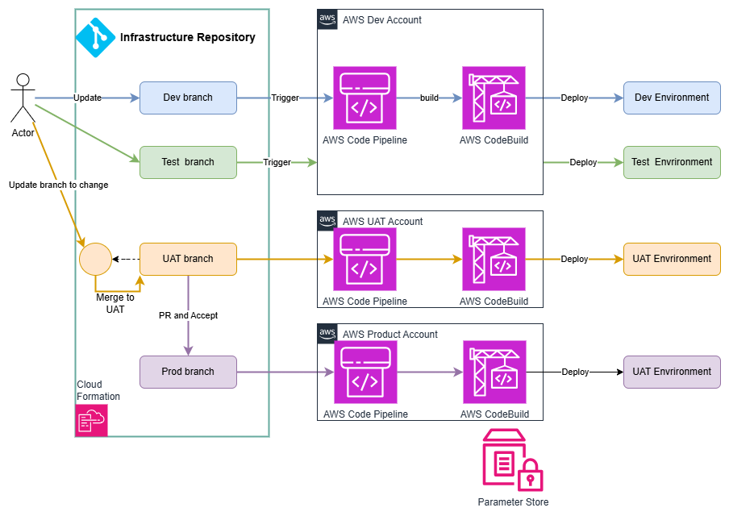

## 7. Deployment View

This section describes the physical deployment of the Smarthome IoT platform on **AWS**, where **Amazon EKS** is used as the core compute platform to support a **cloud-native microservices architecture**, and the **CI/CD flow follows a GitOps approach** for automated, declarative, and version-controlled delivery across environments.

### 7.1 AWS Cloud Architect

#### 7.1.1 Deployment Topology within AWS IoT Account

The IoT system is deployed to a dedicated **AWS SmartHomeIot** Account, which is a managed member of the centralized **AWS PRDCV (Panasonic R&D Center Vietnam) Organization**. This setup enables shared governance, cross-account networking, and centralized operations through AWS Control Tower and Transit Gateway.

Key components and deployment details include:

- The **Admin Console (Web UI)** is a single-page application deployed on **AWS S3** and served to users via **AWS CloudFront**.

- Users from the **Web Admin App, Engineer Mobile App, and End-User Mobile App** access backend services through an **Application Load Balancer (ALB)** deployed in public subnets, which routes incoming HTTPS traffic to a **Kong API Gateway** deployed within the **EKS cluster**.

- **Amazon Route 53** provides DNS management, while **AWS Certificate Manager (ACM)** issues trusted SSL/TLS certificates to secure HTTPS traffic.

- The **Kong API Gateway**, deployed natively on **Kubernetes (EKS)**, serves as the unified entry point for all external traffic, handling request routing, rate limiting, and API-level security. It integrates directly with **AWS Cognito** using the **OIDC protocol** for authentication and authorization.

- The **EKS Cluster** spans multiple availability zones, with multiple **EC2-based node groups**, each aligned with different roles (e.g., microservices, system services) and IAM permissions. All workloads are deployed in **private subnets** for network security.

- Core microservices—including **User Service, Building Service, Device Service**, and **Notification Service—are deployed** in **dedicated Kubernetes namespaces** and mapped to **separate node groups** to ensure isolation, scalability, and fine-grained operational control.

- Data services such as **AWS DocumentDB** (MongoDB-compatible), **AWS OpenSearch**, and **Amazon MSK (Kafka)** are deployed in private subnets.

- **InfluxDB** is deployed using an **EC2 Auto Scaling Group** for high availability and stores real-time metrics and telemetry data from devices.

- **AWS Systems Manager (SSM)** is enabled to manage configurations, patching, and access control across EC2 resources and Kubernetes nodes.

- Outbound traffic from the IoT system (e.g., integration with **Tuya Cloud**) is routed through a **Transit Gateway**, which connects the Smarthome Iot VPC to a **centralized Network Account**, following the centralized networking strategy of the **AWS PRDCV Organization**.

- **CloudWatch** is used to collect system logs and metrics via **Interface VPC Endpoints**, ensuring that all observability traffic remains within the AWS network.

- **Istio** is still used as the **internal service mesh**, providing service-to-service security, traffic routing, and observability. Traces are collected via **OpenTelemetry** and forwarded to **AWS X-Ray**.

Container images for all services are stored in **Amazon ECR**, and **Helm charts** used for deployment are managed via **AWS Artifact** to ensure consistent, versioned deployment workflows.

This deployment architecture ensures **security, resilience, and operational scalability**, while aligning with AWS cloud-native best practices and centralized organizational controls.

#### 7.1.2 Centralized Management with AWS PRDCV Organization

The **SmarthomeIot system** is part of a centrally governed **AWS PRDCV Organization**, which provides a unified structure for managing multiple AWS accounts. This organizational model supports:

- **Centralized billing** and **cost allocation**, enabling consolidated usage tracking, volume discounts, and optimized budgeting across business units and environments.

- Enforcement of **organization-wide governance policies** using **AWS Control Tower controls** (formerly known as guardrails), **Service Control Policies (SCPs)**, and centralized **IAM role management** to maintain compliance and security standards.

- **Shared infrastructure components**, such as **Transit Gateway**, centralized VPCs, and logging/auditing services, which promote reusability and reduce operational overhead.

Standardized **account provisioning**, environment setup, and configuration management via **Control Tower landing zones** and the account factory model.

This structure ensures consistent governance, operational efficiency, and security alignment across the **AWS PRDCV Solution ecosystem**, supporting scalable and compliant deployment of SmartHomeIot workloads.

### 7.2 CI/CD Flow (GitOps) 

The Smarthome IoT adopts a **GitOps-based CI/CD approach**, where both **infrastructure provisioning** and **application deployment** are managed as code. Changes are tracked via Git, reviewed through pull requests, and automatically applied to target environments through declarative pipelines. This ensures reproducibility, auditability, and consistency across the system lifecycle.

**Target Environments**
The CI/CD workflow supports four dedicated environments aligned with the development and delivery stages. Each environment has different resource sizing and integration targets:

| Environment | Purpose | Resource Allocation | Tuya Integration |Key Activities|
|---|---|---|---|---|
|**Dev**|Development & integration testing|Minimal|Tuya Mock API|Developer testing, API mocking|
|**Test**|Functional & system testing|Small|Tuya UAT|QA testing, feature validation|
|**UAT**|Staging & performance testing|Small|Tuya UAT|Pre-production testing, performance|
|**Prod**|Live production|Full-scale|Tuya Cloud (Production)|Real-world usage, live customer access|

#### 7.2.1 Infrastructure Installation Flow

The **Infrastructure Installation Flow** is responsible for provisioning and maintaining the core AWS infrastructure required to support the IoT system across all environments. This flow follows a **GitOps approach** combined with a **GitFlow branching model**, enabling traceable, repeatable, and controlled infrastructure deployments.

**Infrastructure-as-Code and Deployment Tooling**
- **AWS CloudFormation** is used to declaratively define all infrastructure components (networking, compute, security, storage, etc.).

- **AWS CodePipeline** and **AWS CodeBuild** are configured to monitor changes in Git repositories, build infrastructure artifacts, and apply CloudFormation stacks accordingly.

- **AWS Systems Manager Parameter Store** is used to manage environment-specific parameters, secrets, and configurations, enabling environment differentiation without code changes.

**GitFlow-based Environment Branches** 
The Git repository is structured into four long-lived branches, each corresponding to a target deployment environment:

| Branch | Target Environment | AWS Account | Approval Required |Deployment Trigger|
|---|---|---|---|---|
|`dev`|Dev|Shared (Dev/Test)|No|On commit push|
|`test`|Test|Shared (Dev/Test)|No|On commit push|
|`uat`|UAT|Dedicated|Yes (Pull Request)|On merge to `uat` branch|
|production|Production|Dedicated|Yes (Pull Request)|On merge to `production`|

**Environment-Specific Deployment Strategy**
- **Dev & Test Environments:** 
Deployed in a **shared AWS account** with resources differentiated using AWS Tags. Developers can push directly to the dev or test branches, triggering auto-deployment pipelines for fast iteration and testing.

- **UAT Environment** 
Hosted in a **dedicated AWS account**, used for stakeholder validation, demos, and performance testing.
Changes must follow a **feature-branch → pull request → merge to** `uat` workflow, followed by automatic deployment.

- **Production Environment** 
Hosted in a **separate AWS account**, this environment is gated by formal approval processes. Only code that has passed UAT is merged into `production`.
**All environment-specific configurations** are handled using **parameterized values in AWS SSM Parameter Store**, enforcing **immutability and consistency** between UAT and production.

**AWS Components Provisioned by the Flow** 
Each environment is provisioned with a tailored set of AWS components, including:
- **Amazon EKS cluster** and node groups (per environment)
- VPC, private/public subnets, and routing tables
- Transit Gateway attachments for centralized networking
- Interface VPC Endpoints (for Cognito, CloudWatch, SSM, etc.)
- Amazon DocumentDB (MongoDB-compatible)
- Amazon OpenSearch Service
- Amazon MSK (Kafka for event streaming)
- EC2 Auto Scaling Group for hosting InfluxDB
- Amazon S3 buckets for logs, artifacts, and front-end hosting
- Amazon CloudWatch for logs, metrics, and dashboards
- AWS ACM for certificate management
- Amazon Route 53 for domain and DNS routing
- IAM roles, service accounts, and SSM Agent activation
- Amazon ECR for Docker image storage
- AWS Artifact repository for Helm charts

**Benefits** 
- Fully automated, version-controlled infrastructure deployment
- Clear separation between environments with controlled change flow
- Immutability guarantees between UAT and Production
- Secure, scalable, and production-ready AWS architecture
- Rapid iteration in Dev/Test with strong governance in UAT/Prod

#### 7.2.2 Smarthome Iot Deployment Flow

The **Smarthome Iot Deployment Flow** governs how application services are built, packaged, and deployed across environments, following a **GitFlow branching strategy, GitOps principles**, and a **declarative, environment-specific deployment process using ArgoCD**.

Each service in the Smarthome IoT platform resides in its **own Git repository**, enabling independent development and release cycles. In addition to the individual service repositories, a centralized **Deployment Repository** is maintained. This repository contains the **environment-specific configuration manifests** (e.g., Helm values or Kubernetes YAML) for every application and acts as the **single source of truth** for deployment across environments.

**Deployment Automation with ArgoCD** 
**ArgoCD** continuously monitors the **Deployment Repository** and automatically synchronizes changes in the respective branches (`dev`, `test`, `uat`, `production`) to the target Kubernetes clusters in each environment. This enables fully automated, declarative deployment without manual intervention.

**GitFlow-based Application Lifecycle** 
The CI/CD flow is organized into distinct stages across the GitFlow branches:

| Stage | 	Git Branch | Image Tag | Deployment Trigger |Target Environment|
|---|---|---|---|---|
|Dev|`develop`|`dev-<hashcode>`|On merge to `develop`|Dev|
|Test|`release/<sprint-name>`|`rls-<hashcode>`|On merge to `release/<sprint-name>`|Test|
|UAT|Git Tag (e.g., `v1.2.0`)|`<tag-version>`|On tag and update to UAT repo|UAT|
|Prod|PR from UAT to `production`|`<tag-version>` (verified)|On PR merge|Production|

**Deployment Workflow Details** 

**1. Develop Stage** 
Code merged to the develop branch triggers:
- Unit testing and static analysis
- Docker image packaging: `dev-<hashcode>`
- Image push to AWS ECR
- Update of the `dev` branch in the **Deployment Repository**
- **ArgoCD** syncs to **Dev Environment**, deploying the new version automatically

**2.Test Stage**
- Once Dev is stabilized, code is merged into the `release/<sprint-name>` branch
- Docker image is built with tag `rls-<hashcode>` and pushed to ECR
- The `test` branch in the **Deployment Repository** is updated
- **ArgoCD** deploys the release candidate to the **Test Environment**
- Any bug fixes merged into release/ are automatically re-deployed

**3. UAT Stage** 
When all planned features in the release branch are approved:
- The code is tagged (e.g., `v1.2.0`)
- The Docker image is tagged with `<tag-version>` and marked as `latest`
- The `uat` branch of the **Deployment Repository** is updated
- **ArgoCD** deploys to the **UAT Environment** for final review and stakeholder sign-off

**4. Production Stage** 
- At go-live, a **Pull Request is opened** from the `uat` to `production` branch in the **Deployment Repository**
- Once the PR is approved and merged:
  - **ArgoCD** deploys the **verified package** (previously tested in UAT) to the **Production Environment**
  - No rebuilding occurs, ensuring **immutability and release consistency**
> **Note**: The image deployed to Production is **identical to the one verified in UAT**, ensuring consistency and trust without any rebuild or repackage step.
