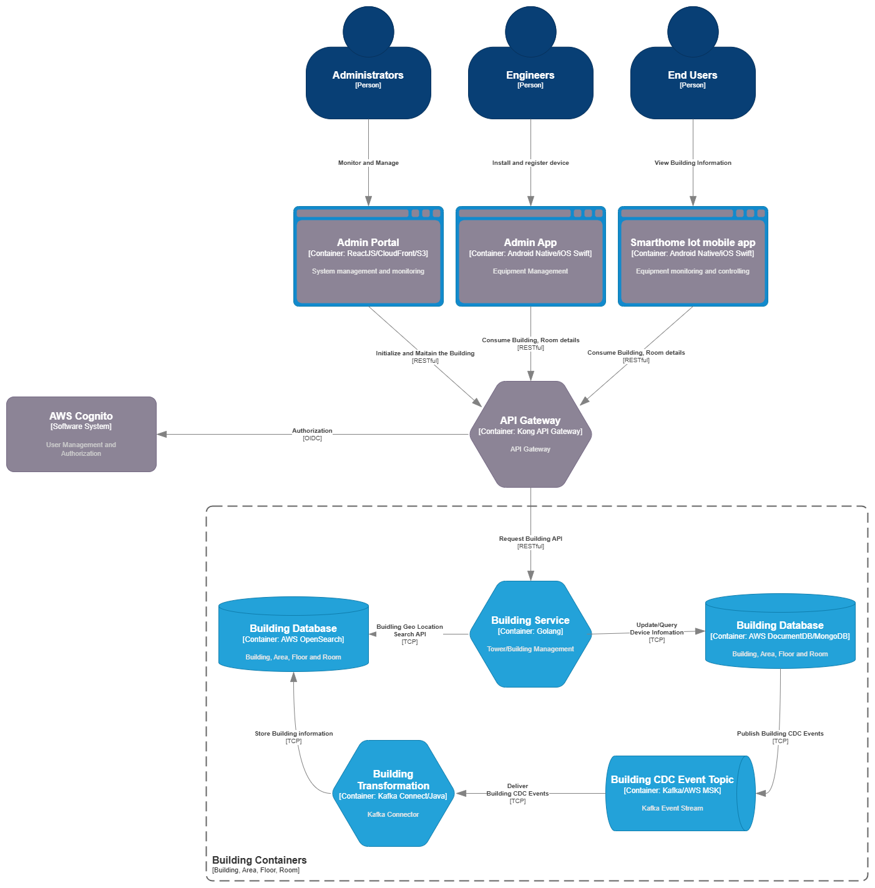

#### 5.2.1 Building Service

The **Building Service** is responsible for managing the structural layout of physical buildings within the system. Through a set of secured **RESTful APIs**, **Administrators** can initialize and maintain building data, including key attributes such as building **name, address, geo-location**, and hierarchical components like **areas, floors, and rooms**.

Data is stored in **MongoDB**, and in AWS environments, this is implemented using **Amazon DocumentDB** for MongoDB compatibility and managed scalability.

To support advanced querying capabilities, the service includes APIs for **full-text search** and **geo-location-based search**, which are powered by **AWS OpenSearch**. A **Kafka Connector** listens for **change data capture (CDC)** events on the building database and streams those updates to OpenSearch indexes in near real-time, enabling efficient and accurate search capabilities.

This service is deployed as a standalone container within the Kubernetes cluster and exposes its interfaces internally and externally through API Gateway routing.