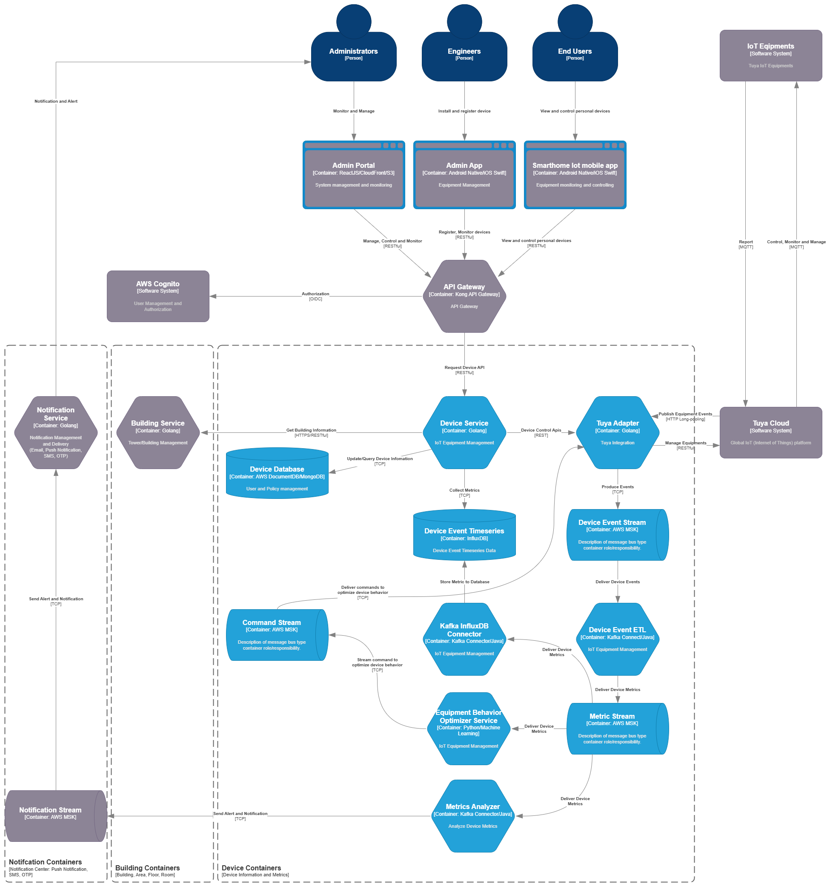

#### 5.2.2 Device Service

The **Device Service** manages the lifecycle and contextual mapping of IoT devices deployed throughout buildings. It exposes a secure **RESTful API** that allows **Engineers** to register new devices and associate them with specific **Building, Area, Floor, and Room** identifiers, as retrieved from the **Building Service**. This ensures precise device placement and ownership alignment within the smart building hierarchy.

To maintain integration flexibility, the system includes a dedicated **Tuya Adapter**, which abstracts communication with **Tuya Cloud**. The adapter handles **device provisioning**, **command execution**, and **state-change event retrieval** through a long-polling subscription channel, ensuring **loose coupling** between the internal system and the external IoT platform.

Incoming device state-change events from Tuya Cloud are preprocessed by the Tuya Adapter and published to the **Device Event Stream** (Kafka topic). These events are consumed by the **Device Event ETL** service, which transforms them into structured, **location-aware environment metrics** and publishes them to the **Metric Stream** for downstream analysis.

Enriched metrics are persisted in the **Device Metrics Timeseries Database** (InfluxDB), supporting historical tracking, visualization, and system monitoring.

The **Equipment Behavior Optimizer Service** leverages these metrics to identify environmental trends (e.g., temperature, humidity) and determine opportunities to optimize device behavior. When an adjustment is required, it issues control commands to the **Device Service**, which then forwards them to the relevant devices through the **Tuya Adapter**.

This component is deployed within **Amazon EKS**, fully containerized, and integrated into the broader platform via **Kafka-based event streams** and **service mesh communication**, ensuring modularity, scalability, and real-time observability.