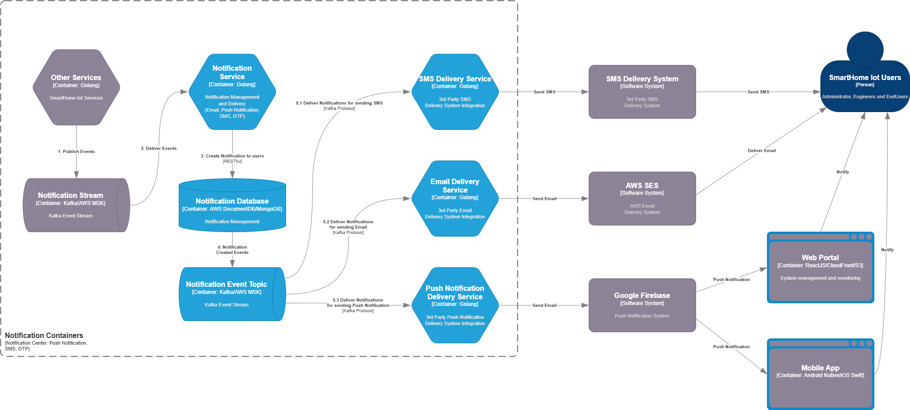

#### 5.2.4 Notification Service 

The **Notification Service** is responsible for managing and delivering user notifications across multiple channels, including **Email**, **Push Notification**, and **SMS**. It handles the full lifecycle of a notification—from event subscription to policy evaluation and final delivery—based on user preferences and system-defined delivery rules.

It **subscribes to the Notification Stream**, where notifications are pre-composed by upstream services such as the **Device Service** and **Building Service**. These services define the **notification kind** (e.g., SMS, Email, Push) and **priority leve**l (e.g., Notification, Warning, Alert) depending on the event type and context.

Upon receiving a message, the Notification Service performs **classification**, applies formatting to produce a user-friendly notification, and persists the final message into the **Notification MongoDB database** for delivery and auditing.

To initiate delivery, a **Change Data Capture (CDC)** stream monitors relevant MongoDB collections. Notification records are emitted into a **Kafka delivery topic**, where they are routed to the appropriate downstream delivery service based on the notification’s specified **delivery methods**.

Delivery is handled by three specialized microservices:

- **SMS Delivery Service:** Integrates with a **third-party SMS gateway** to deliver text messages to users.

- **Email Delivery Service:** Publishes to **AWS SNS**, which manages email distribution and delivery status tracking.

- **Push Notification Delivery Service:** Integrates with **Google Firebase Cloud Messaging (FCM)** to send mobile push notifications to Android and iOS clients.

This architecture ensures **loose coupling** between domain event producers and the delivery mechanisms, supports **multi-channel notification routing**, and allows for **asynchronous, scalable processing** through Kafka and CDC streams. All components are deployed in **Amazon EKS**, using **MongoDB (via AWS DocumentDB)** as the primary data store.
