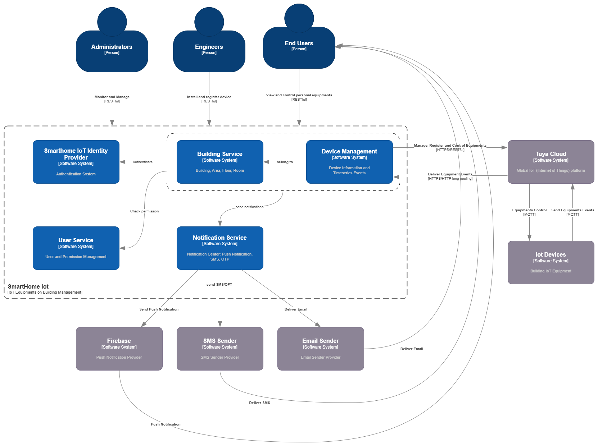

## 5. Building Block View

### 5.1 Level 1: Whitebox System (System Context)

The system is designed to serve a diverse set of users through a centralized user identity solution, providing unified access across services. It integrates with Tuya Cloud for IoT device management and focuses on extending functionality to manage device locations within buildings and user-specific access controls.

To support business requirements, the system is organized around the following key business domains:

- **Building Domain**
Represents the physical infrastructure hierarchy. Each building includes core attributes such as **name, address, and geo-location**, and is further divided into **Areas**, **Floors**, and **Rooms**. This structure enables accurate mapping of devices to their real-world locations.

- **User Domain**
Handles user identity and access management. Each user has common information such as **name, phone number, and email**, and is assigned one or more **roles and permissions**, possibly through **user groups**. For End Users, their building residency is recorded, and access to devices is granted based on **ownership rules and dynamic policy-based authorization**.

- **Device (Equipment) Domain** 
Devices are managed by **Tuya Cloud**, but within our system, they are extended with **location-aware metadata**, linking each device to a specific **building, floor, area, or room**. This enables context-aware control and monitoring from the user interface.

- **Notification Domain**
Users receive alerts and updates through multiple channels including **Email, Push Notifications, and SMS**. Notifications are contextually linked to device events, system alerts, or user-triggered actions.

Together, these domains form the foundation of the system's business logic, enabling **role-based device interaction**, **building-aware visibility**, and **scalable smart building services**.

### 5.2 Level 2: Whitebox for a Key Microservice

To illustrate the internal structure of the system, this section focuses on four core microservices that represent the most critical business domains: **Building Service, Device Service, User Service, and Notification Service**. Each of these services is deployed as an independent containerized application within the Kubernetes cluster and follows the principles of domain-driven design.

The following **C4 Container Diagrams** provide a detailed view of the components, interfaces, external dependencies, and data flows for each service. This breakdown helps stakeholders understand how business responsibilities are distributed, how services interact with each other and external systems (e.g., Tuya Cloud, messaging platforms), and how data is managed and communicated throughout the architecture.

#### 5.2.1 Building Service

Link to [Building Service](./Block-Views/Building-Service.md)

#### 5.2.2 Device Service

Link to [Device Service](./Block-Views/Device-Service.md)

#### 5.2.3 User Service 

Link to [User Service](./Block-Views/User-Service.md)

#### 5.2.4 Notification Service 

Link to [Notification Service](./Block-Views/Notification-Service.md)
