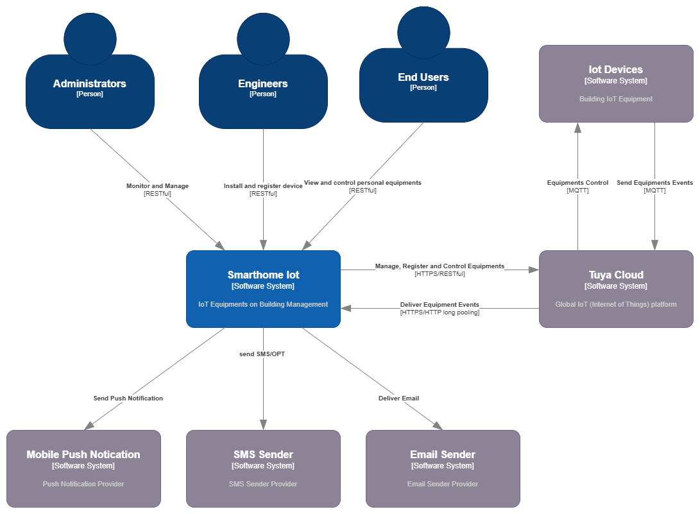

## 3. Context and Scope

### 3.1 Business Context

The system focuses on **IoT device management and monitoring** across **multiple buildings**, with devices organized by detailed physical locations such as **floors, areas, and rooms**. It supports three core user roles:

- **Administrators**: oversee system operations and respond to events

- **Engineers**: perform on-site device installation and registration

- **End Users**: monitor and control authorized in-house devices

The system integrates with **Tuya Cloud** as the **primary platform for IoT device connectivity and control**, enabling seamless communication with a wide range of smart devices. Additionally, it relies on an **external identity provider** for user authentication and access control, and uses **external messaging services** for delivering notifications via email, SMS, and push channels.

### 3.2 Technical Context

The system consists of several frontend and backend components designed to serve various user roles and business domains. It follows a cloud-native architecture hosted primarily on AWS, with integrations to third-party platforms and services for enhanced capabilities.

#### 📱 Client Applications
- **Web UI :**
A responsive web interface for **Administrators**, used for system monitoring, user and building management. The UI is hosted on **AWS S3** and delivered via **AWS CloudFront** as a globally accessible static site.

- **Mobile Applications**

  + **Engineer App** (Android & iOS): Supports on-site device installation and registration.

  + **End-User App** (Android & iOS): Allows users to view and control their owned devices within assigned buildings and rooms.

#### ⚙️ Backend and Infrastructure
- **Microservices :**
Core business logic is implemented as modular microservices deployed on **Amazon EKS (Elastic Kubernetes Service)**. Each service corresponds to a specific domain (e.g., User, Building, Device, Notification).

- **AWS Application Load Balancer :**
Serves as the **internet-facing entry point**, terminating **SSL/TLS connections** and enforcing **web security policies** via **AWS WAF**. It then forwards validated requests to the **Kong API Gateway** deployed within the Kubernetes cluster for further routing to backend microservices.

- **Authentication :**
**AWS Cognito** provides **Single Sign-On (SSO)**, user authentication, and access token management for all application clients.

- **Notification Delivery :**
**Google Firebase Cloud Messaging (FCM)** is used to send **push notifications** to mobile applications.

- **Messaging System :**
**Apache Kafka** serves as the asynchronous messaging backbone, enabling event-driven communication between microservices for scalability and decoupling.

#### 🗄️ Storage and Data Management
- **AWS DocumentDB :**
Stores structured application data such as user profiles, building models, device mappings, and access policies.

- **InfluxDB :**
Handles **time-series data** such as device telemetry, sensor readings, and historical performance metrics.

- **AWS OpenSearch :**
Powers **geo-spatial search and filtering** for buildings, floors, and rooms based on location attributes (e.g., finding nearby devices or structures).

This architecture supports a highly scalable, modular, and extensible platform optimized for smart building management, while remaining portable for future multi-cloud adoption.
