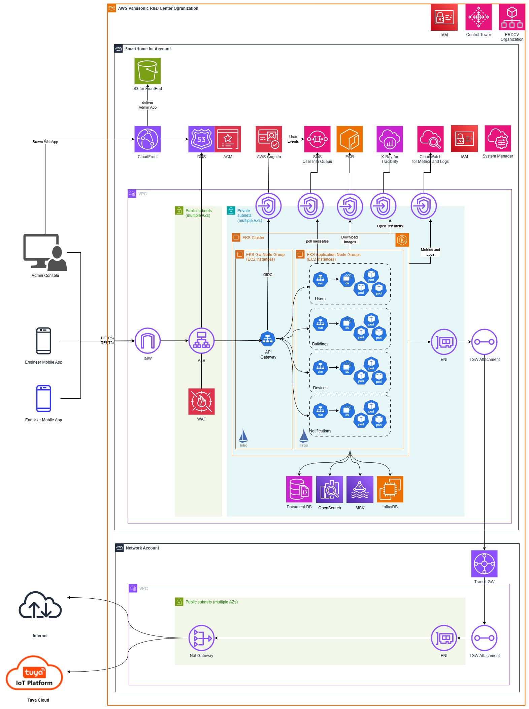

# Smarthome Iot

 **Smarthome Iot** is a **microservices-based IoT platform** designed for the **registration, management, and monitoring** of up to 1 million **IoT devices** deployed across **multiple buildings**. Devices are logically structured under a hierarchy of **Building, Floor, Area, and Room**, enabling precise **location tracking** and **streamlined operations**. The system supports three main user roles: **Engineers** who install and register devices on-site, **Administrators** who monitor system health and respond to building-level events, and **End Users** who can control and monitor their in-house devices, such as cameras, lights, or air conditioners, via personalized interfaces. The architecture ensures **scalability**, **real-time responsiveness**, and **flexibility** for **large-scale smart building environments**.

## Table of Content

- [Smarthome Iot](#smarthome-iot)
  - [Table of Content](#table-of-content)
  - [1. Introduction and Goals](#1-introduction-and-goals)
    - [1.1 Requirements Overview](#11-requirements-overview)
    - [1.2 Quality Goals](#12-quality-goals)
    - [1.3 Stakeholders](#13-stakeholders)
  - [2. Architecture Constraints](#2-architecture-constraints)
    - [2.1 Technical Constraints](#21-technical-constraints)
    - [2.2 Development Constraints](#22-development-constraints)
  - [3. Context and Scope](#3-context-and-scope)
    - [3.1 Business Context](#31-business-context)
    - [3.2 Technical Context](#32-technical-context)
      - [📱 Client Applications](#-client-applications)
      - [⚙️ Backend and Infrastructure](#️-backend-and-infrastructure)
      - [🗄️ Storage and Data Management](#️-storage-and-data-management)
  - [4. Solution Strategy](#4-solution-strategy)
  - [5. Building Block View](#5-building-block-view)
    - [5.1 Level 1: Whitebox System (System Context)](#51-level-1-whitebox-system-system-context)
    - [5.2 Level 2: Whitebox for a Key Microservice](#52-level-2-whitebox-for-a-key-microservice)
      - [5.2.1 Building Service](#521-building-service)
      - [5.2.2 Device Service](#522-device-service)
      - [5.2.3 User Service](#523-user-service)
      - [5.2.4 Notification Service](#524-notification-service)
  - [6. Runtime View](#6-runtime-view)
    - [6.1 Building Construction](#61-building-construction)
    - [6.2 Device Registration](#62-device-registration)
    - [6.3 Device Event Processing and Metric Distribution](#63-device-event-processing-and-metric-distribution)
  - [7. Deployment View](#7-deployment-view)
    - [7.1 AWS Cloud Architect](#71-aws-cloud-architect)
      - [7.1.1 Deployment Topology within AWS IoT Account](#711-deployment-topology-within-aws-iot-account)
      - [7.1.2 Centralized Management with AWS PRDCV Organization](#712-centralized-management-with-aws-prdcv-organization)
    - [7.2 CI/CD Flow (GitOps)](#72-cicd-flow-gitops)
      - [7.2.1 Infrastructure Installation Flow](#721-infrastructure-installation-flow)
      - [7.2.2 Smarthome Iot Deployment Flow](#722-smarthome-iot-deployment-flow)
  - [8.Crosscutting Concepts](#8crosscutting-concepts)
    - [8.1 Authentication and Authorization](#81-authentication-and-authorization)
    - [8.2 Microservices Dependency Management](#82-microservices-dependency-management)
    - [8.3 Event-Driven Strategy](#83-event-driven-strategy)
    - [8.4 System observability](#84-system-observability)
  - [9. Architecture Decisions](#9-architecture-decisions)
    - [9.1 EKS for container orchestration](#91-eks-for-container-orchestration)
    - [9.2 Kong API Gateway inside EKS instead of using AWS API Gateway](#92-kong-api-gateway-inside-eks-instead-of-using-aws-api-gateway)
    - [9.3 MongoDB vs Aurora PostgreSQL](#93-mongodb-vs-aurora-postgresql)
  - [10. Quality Requirements](#10-quality-requirements)
    - [10.1 Quality Management in Development](#101-quality-management-in-development)
    - [10.2 Non-Functional Requirements](#102-non-functional-requirements)
  - [11. Risks and Technical Debt](#11-risks-and-technical-debt)
  - [12. Glossary](#12-glossary)

## 6. Runtime View

This section presents three key **runtime use cases** that demonstrate how the system behaves during typical operational workflows. Each scenario outlines the dynamic interactions between core microservices, external platforms, and users to fulfill specific business processes. The selected use cases cover both administrative and operational aspects of the system:

- **Building Construction by Administrator** – Setting up buildings, areas, floors, and rooms, and assigning responsibility through user groups.

- **Device Registration** – Installing and registering new IoT equipment and notifying responsible users via email and push notification.

- **Device Event Processing** – Retrieving real-time device events from Tuya Cloud, transforming and analyzing data, and initiating follow-up actions.

These scenarios illustrate how the system leverages **microservices**, **event-driven messaging**, and **external integrations** to support smart building operations in a scalable and modular way.

### 6.1 Building Construction

When an Administrator creates a new Area within a building, the system performs the following steps:
- The Administrator searches and selects the target Building via the Building Service API.
- The Administrator queries the User Service to select the User Group responsible for the new Area.
- The Area creation request is submitted to the Building Service.
- The Building Service persists the Area into MongoDB (DocumentDB).
- A CDC event is published to the Building CDC Kafka Stream.
- The Elasticsearch Collector consumes the event and indexes the Area into OpenSearch, enabling geo-based and full-text search capabilities.

Upon successful Area creation, a notification is generated and delivered to users in the assigned User Group:

- The Notification Collector consumes the Area Created event, transforms it into a notification message, and sends it to the Notification Stream.
- The Notification Service consumes the event, queries the User Service to retrieve the recipients, and stores the composed notification in the Notification MongoDB Collection.
- A CDC event is triggered on notification insertion and published to the Notification CDC Stream

- The Push Notification Service consumes events from the Notification CDC Stream and delivers push notifications to users via Firebase.

- The Email Delivery Service processes the same stream and sends corresponding emails through the integrated email provider.

### 6.2 Device Registration

In the **Smarthome IoT** system, IoT devices are not managed or controlled directly. Instead, the system integrates with **Tuya Cloud**, which handles the actual device lifecycle and operations. As a result, when an Engineer registers a device, it enters the system as a **SHADOW** representation and only becomes **ACTIVATED** upon successful acceptance by Tuya Cloud. If Tuya Cloud rejects the device submission, the status changes to **REJECTED**.

**Step 1: Register Device**
- The Engineer selects the appropriate **area/room** of **Building** using the **Building Service API**.

- The Engineer submits a **Device Registration request** to the **Device Service**.

- The device is saved in the system in a **SHADOW state**, representing a pending registration.

- A CDC event is published to the **Device CDC Kafka Stream**.

**Step 2: Submit to Tuya Cloud**
- The **Tuya Adapter** listens for **new device CDC events** and submits the device information to **Tuya Cloud**.

- If **Tuya Cloud accepts** the device, the Tuya Adapter emits a **Device Confirmation Event** to the **Device Event Stream**.

- The **Device Service** consumes this confirmation event, updates the device’s state to **ACTIVATED**, and emits an updated **CDC event** to the **Device CDC Kafka Stream**.

**Step 3: Notify Associated Users**
- Once the device is activated, the **Device Notification Collector** gathers **location metadata** (e.g., Area/Room) from the **Building Service**.
- It then retrieves the list of **responsible users** from the **User Service**, based on the user group assigned to the device’s area, which was configured during the building construction process described in [Section 6.1](#61-building-construction).
- A notification is composed and sent to the Notification Stream.

The **Notification Service** will then take over the process, delivering notifications to end users and administrators via **Email**, **Push Notification**, or **SMS**, depending on user preferences and configured delivery methods.

### 6.3 Device Event Processing and Metric Distribution

The **Tuya Adapter** plays a central role in continuously **subscribing to device events** from **Tuya Cloud** using a long-polling mechanism. Upon receiving each event, the adapter performs **initial preprocessing**, converting the raw Tuya payload into a standardized **SmartHome Iot** message format. These normalized events are then published to the **Device Event Stream** (Kafka topic).

The **Device Event ETL** service subscribes to the **Device Event Stream** and acts as the **primary processor** of incoming device events. It performs **real-time transformation**, **classification**, and **enrichment**, producing a variety of structured **metrics** (e.g., temperature, motion, power consumption). These metrics are then published to the **Metric Stream** for downstream consumers.

Several services in the **Smarthome Iot** platform consume the **Metric Stream** to support specialized business functions. Key services include:

- **Kafka–InfluxDB Connector** 
The **Kafka InfluxDB Connector** consumes metrics from the Metric Stream and writes them to the **InfluxDB Timeseries Database**. This enables system-wide telemetry analysis and historical monitoring. The **Device Manager** can present these metrics to Administrators via dashboards for visibility into system performance and trends.

- **Metrics Analyzer** 
The **Metrics Analyzer** service uses real-time metrics to detect **environmental hazards** and **identify potential threats**, such as **fire, smoke, gas leaks, or intrusions**. Alerts are triggered proactively based on defined thresholds or pattern recognition algorithms.

- **Equipment Behavior Optimizer**
The **Equipment Behavior Optimizer** processes metrics related to ***environmental conditions** — such as temperature and humidity—to determine if device behavior (e.g., air conditioning, lighting) should be adjusted. It sends optimization commands to improve **comfort**, **energy efficiency**, and **overall quality of life** in affected areas.

This runtime scenario illustrates how the system applies **stream processing**, **event normalization**, and **modular analytics pipelines** to derive real-time insights and automate actions within smart environments.

## 7. Deployment View

This section describes the physical deployment of the Smarthome IoT platform on **AWS**, where **Amazon EKS** is used as the core compute platform to support a **cloud-native microservices architecture**, and the **CI/CD flow follows a GitOps approach** for automated, declarative, and version-controlled delivery across environments.

### 7.1 AWS Cloud Architect

#### 7.1.1 Deployment Topology within AWS IoT Account

The IoT system is deployed to a dedicated **AWS SmartHomeIot** Account, which is a managed member of the centralized **AWS PRDCV (Panasonic R&D Center Vietnam) Organization**. This setup enables shared governance, cross-account networking, and centralized operations through AWS Control Tower and Transit Gateway.

Key components and deployment details include:

- The **Admin Console (Web UI)** is a single-page application deployed on **AWS S3** and served to users via **AWS CloudFront**.

- Users from the **Web Admin App, Engineer Mobile App, and End-User Mobile App** access backend services through an **Application Load Balancer (ALB)** deployed in public subnets, which routes incoming HTTPS traffic to a **Kong API Gateway** deployed within the **EKS cluster**.

- **Amazon Route 53** provides DNS management, while **AWS Certificate Manager (ACM)** issues trusted SSL/TLS certificates to secure HTTPS traffic.

- The **Kong API Gateway**, deployed natively on **Kubernetes (EKS)**, serves as the unified entry point for all external traffic, handling request routing, rate limiting, and API-level security. It integrates directly with **AWS Cognito** using the **OIDC protocol** for authentication and authorization.

- The **EKS Cluster** spans multiple availability zones, with multiple **EC2-based node groups**, each aligned with different roles (e.g., microservices, system services) and IAM permissions. All workloads are deployed in **private subnets** for network security.

- Core microservices—including **User Service, Building Service, Device Service**, and **Notification Service—are deployed** in **dedicated Kubernetes namespaces** and mapped to **separate node groups** to ensure isolation, scalability, and fine-grained operational control.

- Data services such as **AWS DocumentDB** (MongoDB-compatible), **AWS OpenSearch**, and **Amazon MSK (Kafka)** are deployed in private subnets.

- **InfluxDB** is deployed using an **EC2 Auto Scaling Group** for high availability and stores real-time metrics and telemetry data from devices.

- **AWS Systems Manager (SSM)** is enabled to manage configurations, patching, and access control across EC2 resources and Kubernetes nodes.

- Outbound traffic from the IoT system (e.g., integration with **Tuya Cloud**) is routed through a **Transit Gateway**, which connects the Smarthome Iot VPC to a **centralized Network Account**, following the centralized networking strategy of the **AWS PRDCV Organization**.

- **CloudWatch** is used to collect system logs and metrics via **Interface VPC Endpoints**, ensuring that all observability traffic remains within the AWS network.

- **Istio** is still used as the **internal service mesh**, providing service-to-service security, traffic routing, and observability. Traces are collected via **OpenTelemetry** and forwarded to **AWS X-Ray**.

Container images for all services are stored in **Amazon ECR**, and **Helm charts** used for deployment are managed via **AWS Artifact** to ensure consistent, versioned deployment workflows.

This deployment architecture ensures **security, resilience, and operational scalability**, while aligning with AWS cloud-native best practices and centralized organizational controls.

#### 7.1.2 Centralized Management with AWS PRDCV Organization

The **SmarthomeIot system** is part of a centrally governed **AWS PRDCV Organization**, which provides a unified structure for managing multiple AWS accounts. This organizational model supports:

- **Centralized billing** and **cost allocation**, enabling consolidated usage tracking, volume discounts, and optimized budgeting across business units and environments.

- Enforcement of **organization-wide governance policies** using **AWS Control Tower controls** (formerly known as guardrails), **Service Control Policies (SCPs)**, and centralized **IAM role management** to maintain compliance and security standards.

- **Shared infrastructure components**, such as **Transit Gateway**, centralized VPCs, and logging/auditing services, which promote reusability and reduce operational overhead.

Standardized **account provisioning**, environment setup, and configuration management via **Control Tower landing zones** and the account factory model.

This structure ensures consistent governance, operational efficiency, and security alignment across the **AWS PRDCV Solution ecosystem**, supporting scalable and compliant deployment of SmartHomeIot workloads.

### 7.2 CI/CD Flow (GitOps) 

The Smarthome IoT adopts a **GitOps-based CI/CD approach**, where both **infrastructure provisioning** and **application deployment** are managed as code. Changes are tracked via Git, reviewed through pull requests, and automatically applied to target environments through declarative pipelines. This ensures reproducibility, auditability, and consistency across the system lifecycle.

**Target Environments**
The CI/CD workflow supports four dedicated environments aligned with the development and delivery stages. Each environment has different resource sizing and integration targets:

| Environment | Purpose | Resource Allocation | Tuya Integration |Key Activities|
|---|---|---|---|---|
|**Dev**|Development & integration testing|Minimal|Tuya Mock API|Developer testing, API mocking|
|**Test**|Functional & system testing|Small|Tuya UAT|QA testing, feature validation|
|**UAT**|Staging & performance testing|Small|Tuya UAT|Pre-production testing, performance|
|**Prod**|Live production|Full-scale|Tuya Cloud (Production)|Real-world usage, live customer access|

#### 7.2.1 Infrastructure Installation Flow

The **Infrastructure Installation Flow** is responsible for provisioning and maintaining the core AWS infrastructure required to support the IoT system across all environments. This flow follows a **GitOps approach** combined with a **GitFlow branching model**, enabling traceable, repeatable, and controlled infrastructure deployments.

**Infrastructure-as-Code and Deployment Tooling**
- **AWS CloudFormation** is used to declaratively define all infrastructure components (networking, compute, security, storage, etc.).

- **AWS CodePipeline** and **AWS CodeBuild** are configured to monitor changes in Git repositories, build infrastructure artifacts, and apply CloudFormation stacks accordingly.

- **AWS Systems Manager Parameter Store** is used to manage environment-specific parameters, secrets, and configurations, enabling environment differentiation without code changes.

**GitFlow-based Environment Branches** 
The Git repository is structured into four long-lived branches, each corresponding to a target deployment environment:

| Branch | Target Environment | AWS Account | Approval Required |Deployment Trigger|
|---|---|---|---|---|
|`dev`|Dev|Shared (Dev/Test)|No|On commit push|
|`test`|Test|Shared (Dev/Test)|No|On commit push|
|`uat`|UAT|Dedicated|Yes (Pull Request)|On merge to `uat` branch|
|production|Production|Dedicated|Yes (Pull Request)|On merge to `production`|

**Environment-Specific Deployment Strategy**
- **Dev & Test Environments:** 
Deployed in a **shared AWS account** with resources differentiated using AWS Tags. Developers can push directly to the dev or test branches, triggering auto-deployment pipelines for fast iteration and testing.

- **UAT Environment** 
Hosted in a **dedicated AWS account**, used for stakeholder validation, demos, and performance testing.
Changes must follow a **feature-branch → pull request → merge to** `uat` workflow, followed by automatic deployment.

- **Production Environment** 
Hosted in a **separate AWS account**, this environment is gated by formal approval processes. Only code that has passed UAT is merged into `production`.
**All environment-specific configurations** are handled using **parameterized values in AWS SSM Parameter Store**, enforcing **immutability and consistency** between UAT and production.

**AWS Components Provisioned by the Flow** 
Each environment is provisioned with a tailored set of AWS components, including:
- **Amazon EKS cluster** and node groups (per environment)
- VPC, private/public subnets, and routing tables
- Transit Gateway attachments for centralized networking
- Interface VPC Endpoints (for Cognito, CloudWatch, SSM, etc.)
- Amazon DocumentDB (MongoDB-compatible)
- Amazon OpenSearch Service
- Amazon MSK (Kafka for event streaming)
- EC2 Auto Scaling Group for hosting InfluxDB
- Amazon S3 buckets for logs, artifacts, and front-end hosting
- Amazon CloudWatch for logs, metrics, and dashboards
- AWS ACM for certificate management
- Amazon Route 53 for domain and DNS routing
- IAM roles, service accounts, and SSM Agent activation
- Amazon ECR for Docker image storage
- AWS Artifact repository for Helm charts

**Benefits** 
- Fully automated, version-controlled infrastructure deployment
- Clear separation between environments with controlled change flow
- Immutability guarantees between UAT and Production
- Secure, scalable, and production-ready AWS architecture
- Rapid iteration in Dev/Test with strong governance in UAT/Prod

#### 7.2.2 Smarthome Iot Deployment Flow

The **Smarthome Iot Deployment Flow** governs how application services are built, packaged, and deployed across environments, following a **GitFlow branching strategy, GitOps principles**, and a **declarative, environment-specific deployment process using ArgoCD**.

Each service in the Smarthome IoT platform resides in its **own Git repository**, enabling independent development and release cycles. In addition to the individual service repositories, a centralized **Deployment Repository** is maintained. This repository contains the **environment-specific configuration manifests** (e.g., Helm values or Kubernetes YAML) for every application and acts as the **single source of truth** for deployment across environments.

**Deployment Automation with ArgoCD** 
**ArgoCD** continuously monitors the **Deployment Repository** and automatically synchronizes changes in the respective branches (`dev`, `test`, `uat`, `production`) to the target Kubernetes clusters in each environment. This enables fully automated, declarative deployment without manual intervention.

**GitFlow-based Application Lifecycle** 
The CI/CD flow is organized into distinct stages across the GitFlow branches:

| Stage | 	Git Branch | Image Tag | Deployment Trigger |Target Environment|
|---|---|---|---|---|
|Dev|`develop`|`dev-<hashcode>`|On merge to `develop`|Dev|
|Test|`release/<sprint-name>`|`rls-<hashcode>`|On merge to `release/<sprint-name>`|Test|
|UAT|Git Tag (e.g., `v1.2.0`)|`<tag-version>`|On tag and update to UAT repo|UAT|
|Prod|PR from UAT to `production`|`<tag-version>` (verified)|On PR merge|Production|

**Deployment Workflow Details** 

**1. Develop Stage** 
Code merged to the develop branch triggers:
- Unit testing and static analysis
- Docker image packaging: `dev-<hashcode>`
- Image push to AWS ECR
- Update of the `dev` branch in the **Deployment Repository**
- **ArgoCD** syncs to **Dev Environment**, deploying the new version automatically

**2.Test Stage**
- Once Dev is stabilized, code is merged into the `release/<sprint-name>` branch
- Docker image is built with tag `rls-<hashcode>` and pushed to ECR
- The `test` branch in the **Deployment Repository** is updated
- **ArgoCD** deploys the release candidate to the **Test Environment**
- Any bug fixes merged into release/ are automatically re-deployed

**3. UAT Stage** 
When all planned features in the release branch are approved:
- The code is tagged (e.g., `v1.2.0`)
- The Docker image is tagged with `<tag-version>` and marked as `latest`
- The `uat` branch of the **Deployment Repository** is updated
- **ArgoCD** deploys to the **UAT Environment** for final review and stakeholder sign-off

**4. Production Stage** 
- At go-live, a **Pull Request is opened** from the `uat` to `production` branch in the **Deployment Repository**
- Once the PR is approved and merged:
  - **ArgoCD** deploys the **verified package** (previously tested in UAT) to the **Production Environment**
  - No rebuilding occurs, ensuring **immutability and release consistency**
> **Note**: The image deployed to Production is **identical to the one verified in UAT**, ensuring consistency and trust without any rebuild or repackage step.

## 8.Crosscutting Concepts

This section outlines the **system-wide architectural strategies** and design patterns that are applied consistently across all services in the Smarthome IoT platform. These crosscutting concepts influence the structure, behavior, and operational reliability of the system. The focus is placed on four critical areas that ensure security, resilience, and maintainability:

- Authentication and Authorization
- Microservices Dependency Management
- Event-Driven Strategy
- System Observability

Each of the following subsections describes the approach, tools, and principles adopted to address these concerns in a scalable and cloud-native manner.

### 8.1 Authentication and Authorization

The **Smarthome IoT** system adopts a **centralized authentication and authorization model** to ensure consistent and secure access control across all services.

All incoming **HTTP requests** are processed by the **Kong API Gateway**, which performs two critical checks before routing requests to backend microservices:

- **Authentication:** 
The gateway verifies the request's **JWT token** using **OIDC integration with AWS Cognito**, ensuring that the user is properly authenticated and the token is valid.

- **Authorization:** 
After verifying identity, the gateway calls the **User Service** to validate whether the user has the necessary access rights. Authorization is enforced via **dynamic policy rules** that evaluate user roles, resource ownership, and contextual access constraints.

This approach enables **centralized user permission management**, allowing fine-grained control over access rules without burdening backend services. It also supports the **single-responsibility principle**, ensuring that microservices remain focused on their domain logic while deferring security checks to the edge and permission layer.

### 8.2 Microservices Dependency Management

To manage dependencies between services in a scalable and maintainable way, the Smarthome IoT system adopts **service mesh architecture** using **Istio** as the foundation for internal service-to-service communication.

Key benefits of using Istio include:

- **Decoupled service communication** via sidecar proxies, enabling services to focus solely on their business logic
- **Declarative dependency management**, where communication rules and routing policies are externally defined and centrally controlled
- **Centralized traffic control and policy enforcement**, including retries, circuit breaking, rate limiting, and access rules
- **Built-in observability and telemetry**, providing real-time insights into service health, request traces, and mesh topology

While synchronous communication is managed via Istio, the system also relies heavily on **asynchronous messaging through Kafka** to enable service decoupling at the data flow level. The details of this **event-driven integration model** are covered in **Section 8.3 – Event-Driven Strategy**.

### 8.3 Event-Driven Strategy

The Smarthome IoT system embraces an **event-driven architecture** to enable scalable, asynchronous, and decoupled communication between microservices. This approach forms the backbone of the system’s flexibility and extensibility across diverse business domains such as device telemetry processing, notifications, and behavior optimization.

**Kafka as the core messaging solution** 

**Apache Kafka** is used as the central **event streaming platform**, allowing services to communicate by publishing and subscribing to topics instead of calling each other directly. This architecture provides:

- **Loose coupling** between producers and consumers, enabling independent development and scaling of services
- **Asynchronous workflows**, ideal for device events, data enrichment, and background processing
- **Business extensibility**, where new consumers can subscribe to existing topics without requiring upstream modifications

**Benefits of Event-Driven Design** 
The event-driven strategy in Smarthome IoT provides:
- **Real-time responsiveness** to device events and user actions
- **Resilience and fault tolerance**, since consumers can process messages at their own pace and retry on failure
- **Auditability and traceability**, with messages being persisted and replayable from Kafka for troubleshooting or reprocessing

This architecture complements synchronous API interactions and is tightly integrated with the system’s observability and automation frameworks, ensuring seamless coordination between **real-time event processing** and **reactive microservices**.

### 8.4 System observability

The Smarthome IoT system integrates a robust observability strategy to ensure that logs, traces, and metrics are collected, visualized, and acted upon consistently across all services and environments.

**Log Management – AWS CloudWatch** 

**AWS CloudWatch Logs** is used to manage application and infrastructure logs, especially for the **production environment**. Logs from microservices are centralized via Fluent Bit or CloudWatch agents, enabling:
- Real-time log aggregation for error diagnosis and operational insight
- Production incident investigation and root cause analysis
- Integration with CloudWatch Alarms for log-based alerting
- Long-term retention of structured log data for compliance and audit

**Distributed Tracing – AWS X-Ray via Istio** 
**AWS X-Ray** is integrated with Istio using the **OpenTelemetry protocol** to trace requests flowing across services. This allows visibility into:
- Cross-service request latency
- Trace IDs correlated with user requests or transaction flows
- Bottleneck identification across microservice chains
- Understanding of complex business workflows across the mesh

**System Metrics – Key Monitoring Targets** 
To ensure infrastructure and application health, a variety of **Kubernetes**, **database**, and **streaming platform** metrics are monitored using tools like CloudWatch, Prometheus, Grafana, and OpenSearch Dashboards.

**📊 Kubernetes Metrics (via CloudWatch Container Insights or  Prometheus)**

|Metric | Purpose
|--|--|
|CPU & Memory Usage per Pod/Node | Detect resource saturation and autoscaling triggers
|Pod Availability & Restarts | Identify unstable deployments or crash loops
|Request/Response Latency (Ingress/Service) | Measure API performance and detect timeouts
|Disk I/O and Network Traffic | Monitor service-level throughput and data movement
|HPA & Cluster Autoscaler Events | Track scaling activity and response to load
|Node Status & Conditions | Identify unhealthy or unreachable nodes

**🗄️ Database Metrics** 
Component | Key Metrics | Purpose
-- | -- | --
AWS DocumentDB (MongoDB) | CPU utilization, IOPS, memory, connections, query latency | Monitor performance and prevent overload
AWS OpenSearch | Indexing latency, search latency, heap memory, shard status | Ensure fast querying and prevent memory-related failures
Amazon MSK (Kafka) | Broker health, partition lag, consumer lag, topic throughput | Track delivery guarantees, detect slow consumers
InfluxDB (on EC2) | Write throughput, disk usage, query latency, series cardinality | Ensure time-series metrics are ingested and available reliably

Together, this observability stack provides full visibility into **system behavior, performance bottlenecks**, and **incident root cause analysis**, enabling proactive monitoring and fast operational response.

## 9. Architecture Decisions

This section outlines key architectural decisions made in the Smarthome IoT system, focusing on core platform and technology choices. The documented topics include **container orchestration** strategy,  **API gateway** deployment and **database selection**.

### 9.1 EKS for container orchestration

Although the Smarthome IoT system is primarily deployed on AWS, the architectural vision follows **cloud-native principles**, aiming for **portability across multiple cloud providers and on-premise environments**. To balance **cloud-agnostic flexibility** with **operational efficiency**, the team selected **Amazon EKS** as the container orchestration platform.

EKS provides a **fully managed Kubernetes environment**, enabling the system to benefit from standardized tooling, ecosystem compatibility, and scalability—while offloading control plane management to AWS. This approach aligns with both **cloud-native best practices** and the need to reduce operational burden without locking the system into a single proprietary deployment model.

### 9.2 Kong API Gateway inside EKS instead of using AWS API Gateway

The Smarthome IoT system uses a **centralized authentication and authorization mechanism** based on dynamic policy rules, as described in Section 8.1. To support this across microservices deployed in EKS, the team evaluated two API gateway options: **Kong API Gateway** and **AWS API Gateway**.

**Considered Options** 
- **Option 1: Kong API Gateway**
  - Deployed **inside the Kubernetes cluster** using the Kubernetes Gateway API model
  - Fully **cloud-native** and portable across environments
  - Leverages the **Kong OIDC plugin** to integrate with **AWS Cognito** for **authentication**
  - Supports development of **custom Kong plugins (in Lua)** to connect with the **User Service** for enforcing **authorization policies** based on dynamic rules

- **Option 2: AWS API Gateway**
  - Fully managed AWS service, deployed **outside the Kubernetes cluster** as a **Private REST API**
  - Requires **integration with Lambda authorizers** to enforce custom policies, making **dynamic authorization logic harder to implement**
  - Less aligned with **cloud-native and on-prem portability goals**

**Decision** 
**Kong API Gateway** was selected for its **Kubernetes-native integration, extensibility**, and **alignment with the system’s cloud-native and multi-cloud vision**. Deploying Kong within EKS allows tighter integration with internal services, more flexible control over routing and security, and consistent behavior across all environments.

### 9.3 MongoDB vs Aurora PostgreSQL

The Smarthome IoT system is designed to manage **millions of IoT devices** deployed across buildings, with each device containing metadata and telemetry that may **evolve over time**. As the system grows, the underlying database must support **schema flexibility, horizontal scalability**, and **high write throughput**.

**Amazon Aurora (PostgreSQL-compatible)** is a powerful managed relational database that supports JSON data types and offers strong **cloud-native capabilities** through its PostgreSQL foundation. However, relational databases like Aurora introduce limitations when handling:

- **Flexible or evolving schemas**
- **High-volume write operations**
- **Large-scale document-based datasets**

In contrast, **MongoDB** (document-based NoSQL) is designed to handle such use cases more naturally. Its schema-less model supports frequent data shape changes, and it can scale horizontally to accommodate high write rates and growing data volumes.

**Decision** 
To meet the demands of the Smarthome IoT platform—particularly around **flexibility, scalability**, and **performance under large-scale workloads—MongoDB** was selected as the preferred data model. For AWS deployments, the system uses **Amazon DocumentDB**, a managed MongoDB-compatible service, to reduce operational overhead while maintaining compatibility with cloud infrastructure

## 10. Quality Requirements
This section outlines the quality expectations for the Smarthome IoT system, covering both **development-time quality controls** and **non-functional runtime characteristics** to ensure long-term maintainability, performance, and compliance.

### 10.1 Quality Management in Development

To maintain a high standard of code quality, the following practices are enforced during development:

- **Unit Test Coverage**
  - Backend microservices: minimum **80% coverage**
  - Mobile and Web applications: minimum **60% coverage**
- **Static Code Analysis**
  - No **Critical** or **Major** issues are allowed in SonarQube results during active sprints
  - All code must pass quality gates before merging
- **Security Compliance**
  - No **High or Critical vulnerabilities** are allowed in production releases
  - Any new **Critical CVEs** discovered must be addressed in the next scheduled release cycle
- **Automated Testing**
  - Business logic is verified through **automated functional and integration tests** executed continuously during sprints

### 10.2 Non-Functional Requirements

| Aspect | Requirement Description |
| -- | -- |
| **Performance** | All API responses must complete within **3 seconds** under peak load, validated through performance testing |
| **Reliability** | The system must perform its functions **consistently and accurately**, with high transactional integrity |
| **Availability** | Uptime will comply with defined **SLA requirements**, documented separately |
| **Usability** | The system must offer a **user-friendly interface** across web and mobile platforms |
| **Security** | Compliance with **OWASP Top 10** is mandatory. - **AWS WAF** is used to protect against common web attacks - The platform complies with **GDPR** and aligns with **ISO/IEC 27001** standards|
| **Portability** | The system is designed with a **cloud-native strategy**, ensuring it can be deployed to **any major cloud provider or on-premises** without significant modification |
| **Observability**| The platform must provide comprehensive observability, including: - **Application log tracing** (via AWS CloudWatch Logs) - **Distributed request tracing** (via AWS X-Ray and OpenTelemetry) - **Infrastructure and service-level metrics monitoring** (via CloudWatch, InfluxDB, and Grafana) - Support for **alerting, visualization, and root cause analysis** to ensure operational transparency and traceability |

## 11. Risks and Technical Debt
Risks and technical debt are actively tracked and managed as part of the product backlog. Each identified item is recorded as a **ticket with assigned priority**, and the team allocates **10–15% of sprint capacity** to address them during regular development cycles.

The level of effort dedicated to risk mitigation and debt reduction may be **adjusted based on real-time product priorities** and milestones defined in the **Quality Roadmap**. Any changes to this allocation will be made **through open discussion and alignment with the Product Manager**, ensuring a balance between feature delivery and long-term maintainability.

## 12. Glossary

Term | Definition
| -- | --|
IoT (Internet of Things) | A network of physical devices embedded with sensors, software, and connectivity that enable them to collect and exchange data.
EKS (Elastic Kubernetes Service) | AWS-managed Kubernetes service used to orchestrate containerized microservices in the Smarthome IoT system.
Kubernetes Gateway API | A standard for managing ingress and routing traffic within Kubernetes clusters. Used by Kong in this architecture.
Kong API Gateway | An open-source API gateway deployed inside EKS to manage routing, rate-limiting, authentication, and authorization of API traffic.
AWS API Gateway | A fully managed AWS service for exposing REST and WebSocket APIs, considered as an alternative to Kong.
OIDC (OpenID Connect) | An identity layer built on OAuth 2.0 used to integrate authentication via AWS Cognito.
AWS Cognito | AWS-managed identity service used for authenticating users via OIDC in the system.
User Permission Service | Internal microservice responsible for evaluating dynamic policies and ownership rules for authorization.
DocumentDB | AWS-managed MongoDB-compatible database used to store device metadata and structured documents.
Aurora PostgreSQL | A fully managed SQL database offered by AWS; evaluated as a candidate during architectural planning.
Kafka (MSK) | Apache Kafka, deployed via Amazon MSK, serves as the event streaming platform for asynchronous microservice communication.
InfluxDB | A high-performance time-series database used to store IoT metrics and telemetry data.
OpenSearch | AWS-managed search and analytics engine used for indexing and querying geo-based building data.
Argo CD | A GitOps continuous deployment tool used to synchronize application state in Kubernetes with the configuration stored in Git.
GitOps | A deployment methodology where Git is used as the single source of truth for both infrastructure and application configurations.
CloudFormation | AWS-native Infrastructure-as-Code (IaC) tool used to provision cloud resources in the Infrastructure Installation flow.
SonarQube | Static code analysis tool used to enforce code quality standards and detect security issues.
OWASP Top 10 | A list of the 10 most critical web application security risks, used as a baseline for securing the Smarthome IoT system.
OpenTelemetry | A vendor-neutral standard used for collecting distributed traces and metrics in the system, integrated with AWS X-Ray.
Service Mesh (Istio) | A dedicated infrastructure layer within Kubernetes for controlling and securing service-to-service communication.
CDC (Change Data Capture) | A pattern where changes in a database are published as events (e.g., to Kafka), used for real-time stream processing.
Dynamic Policy Rules | A flexible, runtime-based authorization mechanism used to determine access based on user role, resource ownership, and context.
SLAs (Service-Level Agreements) | Commitments about system availability, response time, or reliability, defined per environment.

